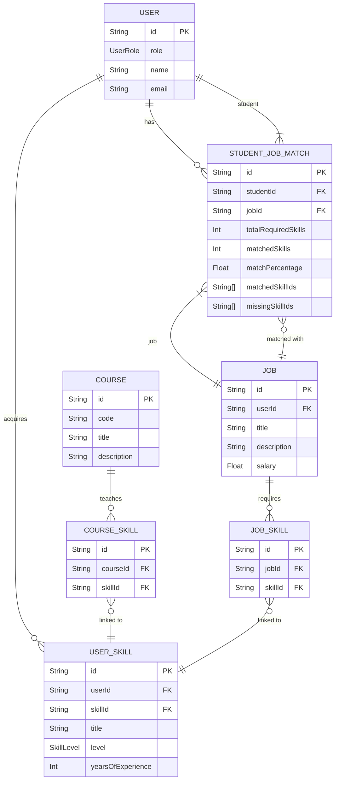

# Skills Feature Relationship Diagram

```mermaid
erDiagram
    USER ||--o{ USER_SKILL : "acquires"
    USER ||--o{ STUDENT_JOB_MATCH : "has"
    COURSE ||--o{ COURSE_SKILL : "teaches"
    COURSE_SKILL }o--|| USER_SKILL : "linked to"
    JOB ||--o{ JOB_SKILL : "requires"
    JOB_SKILL }o--|| USER_SKILL : "linked to"
    JOB ||--o{ STUDENT_JOB_MATCH : "matched with"
    STUDENT_JOB_MATCH }|--|| USER : "student"
    STUDENT_JOB_MATCH }|--|| JOB : "job"

    USER {
        String id PK
        UserRole role
        String name
        String email
    }

    USER_SKILL {
        String id PK
        String userId FK
        String skillId FK
        String title
        SkillLevel level
        Int yearsOfExperience
    }

    COURSE {
        String id PK
        String code
        String title
        String description
    }

    COURSE_SKILL {
        String id PK
        String courseId FK
        String skillId FK
    }

    JOB {
        String id PK
        String userId FK
        String title
        String description
        Float salary
    }

    JOB_SKILL {
        String id PK
        String jobId FK
        String skillId FK
    }

    STUDENT_JOB_MATCH {
        String id PK
        String studentId FK
        String jobId FK
        Int totalRequiredSkills
        Int matchedSkills
        Float matchPercentage
        String[] matchedSkillIds
        String[] missingSkillIds
    }
```