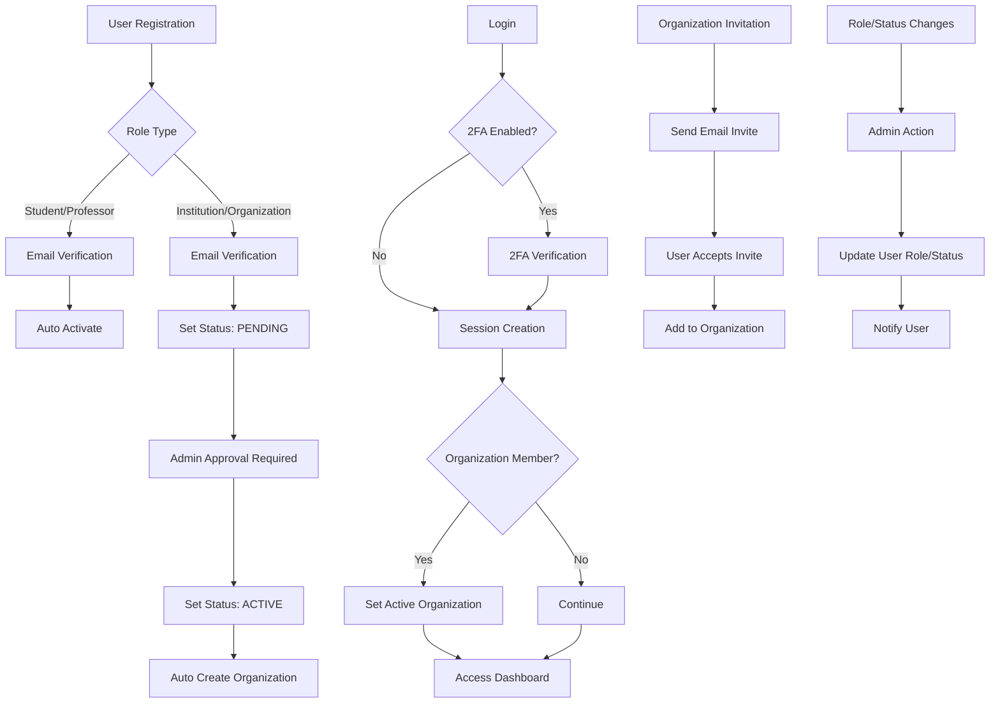

# Authentication Flow Diagram

```mermaid
graph TD
    A[User Registration] --> B{Role Type}
    B -->|Student/Professor| C[Email Verification]
    B -->|Institution/Organization| D[Email Verification]
    C --> E[Auto Activate]
    D --> F[Set Status: PENDING]
    F --> G[Admin Approval Required]
    G --> H[Set Status: ACTIVE]
    H --> I[Auto Create Organization]
    
    J[Login] --> K{2FA Enabled?}
    K -->|Yes| L[2FA Verification]
    K -->|No| M[Session Creation]
    L --> M
    
    M --> N{Organization Member?}
    N -->|Yes| O[Set Active Organization]
    N -->|No| P[Continue]
    O --> Q[Access Dashboard]
    P --> Q
    
    R[Organization Invitation] --> S[Send Email Invite]
    S --> T[User Accepts Invite]
    T --> U[Add to Organization]
    
    V[Role/Status Changes] --> W[Admin Action]
    W --> X[Update User Role/Status]
    X --> Y[Notify User]
```