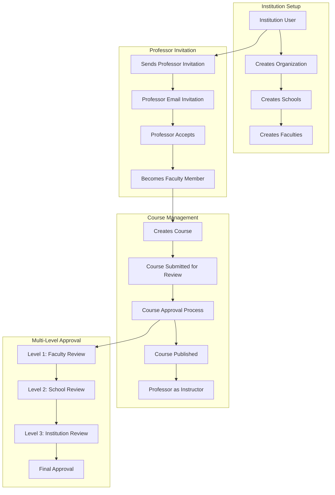

# Institution Professor Invitation and Course Approval Workflow

## Overview

This document describes the enhanced Prisma schema that supports the complete workflow where institutions invite professors, assign them to faculties, and manage course creation and approval processes.

## Workflow Summary



## Enhanced Schema Models

### 1. Professor Invitation System

#### ProfessorInvitation Model
```prisma
model ProfessorInvitation {
  id           String @id @default(cuid()) @map("_id")
  senderId     String // Institution user sending invitation
  sender       User   @relation("InvitationSender", fields: [senderId], references: [id])
  receiverId   String? // User receiving invitation (if they have account)
  receiver     User?  @relation("InvitationReceiver", fields: [receiverId], references: [id])
  
  // Invitation details
  email        String // Email of person being invited
  firstName    String?
  lastName     String?
  
  // Academic assignment
  facultyId    String
  faculty      Faculty @relation(fields: [facultyId], references: [id])
  schoolId     String
  school       School  @relation(fields: [schoolId], references: [id])
  
  // Invitation metadata
  status       InvitationStatus @default(PENDING)
  message      String? // Personal message from institution
  title        String? // Proposed academic title
  department   String? // Department within faculty
  
  // Terms and conditions
  startDate    DateTime?
  contractType String? // Full-time, Part-time, Visiting, etc.
  
  // Tracking
  sentAt       DateTime  @default(now())
  respondedAt  DateTime?
  expiresAt    DateTime
}
```

**Key Features:**
- Direct invitation to specific faculty position
- Comprehensive academic metadata
- Contract terms specification
- Status tracking with timestamps
- Support for both existing and new users

### 2. Enhanced Member Model

The Member model has been significantly enhanced to support professor-specific information:

```prisma
model Member {
  // ... existing fields ...
  
  // Professor-specific fields
  academicTitle    String? // Professor, Associate Professor, etc.
  department       String? // Department within faculty
  officeLocation   String?
  officeHours      String?
  researchInterests String[] @default([])
  academicDegrees   String[] @default([])
  specializations   String[] @default([])
  
  // Contact information
  officePhone      String?
  alternateEmail   String?
  personalWebsite  String?
  
  // Employment details
  employmentType   String? // Full-time, Part-time, Visiting, Adjunct
  contractStartDate DateTime?
  contractEndDate   DateTime?
  tenure           Boolean @default(false)
  
  // Assignment tracking
  assignedAt       DateTime? // When assigned as professor
  assignedBy       String?   // User ID who made the assignment
}
```

### 3. Course Creation and Approval System

#### Enhanced Course Model
```prisma
model Course {
  // ... existing fields ...
  
  credits     Int? // Course credit hours
  
  // Learning objectives and outcomes
  objectives  String[] @default([])
  outcomes    String[] @default([])
  prerequisites String[] @default([])
  
  // Approval workflow tracking
  submittedForApprovalAt DateTime?
  lastReviewedAt         DateTime?
  approvalNotes          String?
  
  // Main instructor (professor who created the course)
  createdById String?
  createdBy   User?  @relation("CourseCreator", fields: [createdById], references: [id])
  
  // Multiple instructors support
  instructorIds String[]
  instructors   User[] @relation("InstructorCourses", fields: [instructorIds], references: [id])
  
  // Approval workflow
  approvalWorkflow CourseApprovalWorkflow?
}
```

#### CourseApprovalWorkflow Model
```prisma
model CourseApprovalWorkflow {
  id       String @id @default(cuid()) @map("_id")
  courseId String @unique // One workflow per course
  course   Course @relation(fields: [courseId], references: [id])
  
  // Workflow state
  currentLevel     Int            @default(1) // Current approval level
  overallStatus    ApprovalStatus @default(PENDING)
  
  // Level definitions (configurable per institution)
  level1Required   Boolean @default(true)  // Faculty Review
  level2Required   Boolean @default(true)  // School Review  
  level3Required   Boolean @default(false) // Institution Review
  
  // Level completion tracking
  level1CompletedAt DateTime?
  level2CompletedAt DateTime?
  level3CompletedAt DateTime?
  
  // Final decision
  finalApprovedAt  DateTime?
  finalRejectedAt  DateTime?
  finalApprover    String? // User ID of final approver
  
  // Revision tracking
  revisionCount    Int @default(0)
  lastRevisionAt   DateTime?
}
```

#### Enhanced CourseApproval Model
```prisma
model CourseApproval {
  // ... existing fields ...
  
  // Approval workflow tracking
  approvalLevel Int @default(1) // 1 = Faculty, 2 = School, 3 = Institution
  isCurrentReview Boolean @default(true) // Is this the current active review?
  
  // Review criteria scoring (optional)
  contentQuality    Int? // 1-5 scale
  academicRigor     Int? // 1-5 scale
  resourceAdequacy  Int? // 1-5 scale
  overallScore      Int? // 1-5 scale
  
  // Required changes/improvements
  requiredChanges   String[] @default([])
  deadlineForChanges DateTime?
}
```

## Enhanced Enums

### New Enums
```prisma
enum InvitationStatus {
  PENDING
  ACCEPTED
  DECLINED
  EXPIRED
  CANCELLED
}

enum InvitationType {
  ORGANIZATION_MEMBER
  PROFESSOR_APPOINTMENT
  FACULTY_ASSIGNMENT
}
```

### Enhanced NotificationType
```prisma
enum NotificationType {
  // ... existing types ...
  PROFESSOR_INVITATION
  COURSE_APPROVAL_REQUEST
  COURSE_APPROVAL_RESULT
}
```

## Workflow Implementation

### 1. Professor Invitation Process

```typescript
// 1. Institution sends professor invitation
const invitation = await prisma.professorInvitation.create({
  data: {
    senderId: institutionUserId,
    email: professorEmail,
    facultyId: targetFacultyId,
    schoolId: facultySchoolId,
    status: 'PENDING',
    title: 'Associate Professor',
    message: 'We would like to invite you to join our faculty...',
    expiresAt: new Date(Date.now() + 30 * 24 * 60 * 60 * 1000), // 30 days
  }
});

// 2. Send email notification
await sendProfessorInvitationEmail(invitation);

// 3. Professor accepts invitation
await prisma.professorInvitation.update({
  where: { id: invitationId },
  data: {
    status: 'ACCEPTED',
    respondedAt: new Date(),
  }
});

// 4. Create member record with professor role
await prisma.member.create({
  data: {
    userId: professorUserId,
    organizationId: institutionOrganizationId,
    facultyId: invitation.facultyId,
    role: 'PROFESSOR',
    academicTitle: invitation.title,
    assignedAt: new Date(),
    assignedBy: invitation.senderId,
  }
});
```

### 2. Course Creation and Approval

```typescript
// 1. Professor creates course
const course = await prisma.course.create({
  data: {
    title: 'Advanced Data Structures',
    code: 'CS401',
    description: 'Advanced study of data structures...',
    facultyId: professorFacultyId,
    createdById: professorUserId,
    status: 'DRAFT',
    instructorIds: [professorUserId],
  }
});

// 2. Professor submits for approval
await prisma.course.update({
  where: { id: courseId },
  data: {
    status: 'PENDING_REVIEW',
    submittedForApprovalAt: new Date(),
  }
});

// 3. Create approval workflow
await prisma.courseApprovalWorkflow.create({
  data: {
    courseId: course.id,
    currentLevel: 1,
    overallStatus: 'PENDING',
    level1Required: true,
    level2Required: true,
    level3Required: false,
  }
});

// 4. Create first level approval request
await prisma.courseApproval.create({
  data: {
    courseId: course.id,
    reviewerId: facultyAdminId,
    approvalLevel: 1,
    isCurrentReview: true,
    status: 'PENDING',
  }
});
```

### 3. Multi-Level Approval Process

```typescript
// Faculty level approval
const facultyApproval = await prisma.courseApproval.update({
  where: { id: approvalId },
  data: {
    status: 'APPROVED',
    reviewedAt: new Date(),
    comments: 'Course content meets faculty standards',
    contentQuality: 4,
    academicRigor: 5,
    overallScore: 4,
  }
});

// Move to next level
await prisma.courseApprovalWorkflow.update({
  where: { courseId },
  data: {
    currentLevel: 2,
    level1CompletedAt: new Date(),
  }
});

// Create school level approval
await prisma.courseApproval.create({
  data: {
    courseId: courseId,
    reviewerId: schoolAdminId,
    approvalLevel: 2,
    isCurrentReview: true,
    status: 'PENDING',
  }
});
```

## API Endpoints

### Professor Invitation Endpoints
- `POST /api/invitations` - Send professor invitation (with type: "PROFESSOR_APPOINTMENT")
- `GET /api/invitations?type=PROFESSOR_APPOINTMENT` - List professor invitations
- `PUT /api/invitations/:id/accept` - Accept invitation (via general invitation endpoint)
- `PUT /api/invitations/:id/decline` - Decline invitation (via general invitation endpoint)

### Course Approval Endpoints
- `POST /api/courses/:id/submit-for-approval` - Submit course for approval
- `GET /api/course-approvals/pending` - Get pending approvals for reviewer
- `PUT /api/course-approvals/:id/approve` - Approve course
- `PUT /api/course-approvals/:id/reject` - Reject course
- `PUT /api/course-approvals/:id/request-revision` - Request revisions

### Faculty Management Endpoints
- `GET /api/faculties/:id/professors` - Get professors in faculty
- `POST /api/faculties/:id/assign-professor` - Assign professor to faculty
- `GET /api/professors/:id/courses` - Get courses taught by professor

## Notification System

The enhanced notification system supports:

1. **Professor Invitation Notifications**
   - Invitation sent notification
   - Invitation acceptance/decline notifications
   - Invitation expiry reminders

2. **Course Approval Notifications**
   - Course submitted for review
   - Approval/rejection notifications
   - Revision request notifications
   - Final approval notifications

3. **Assignment Notifications**
   - Professor assignment confirmations
   - Faculty assignment notifications
   - Role change notifications

## Security and Permissions

### Role-Based Access Control

1. **Institution Users (INSTITUTION role)**
   - Can create schools and faculties
   - Can send professor invitations
   - Can review courses at institution level
   - Can manage organization members

2. **School Administrators (SCHOOL_ADMIN role)**
   - Can manage faculties within their school
   - Can review courses at school level
   - Can assign professors to faculties

3. **Faculty Administrators (FACULTY_ADMIN role)**
   - Can review courses at faculty level
   - Can manage faculty resources
   - Can view faculty professor assignments

4. **Professors (PROFESSOR role)**
   - Can create courses in their assigned faculty
   - Can view their course approval status
   - Can respond to revision requests

## Benefits of This Design

1. **Comprehensive Workflow**: Supports the complete end-to-end process from professor invitation to course publication
2. **Multi-Level Approval**: Flexible approval workflow that can be configured per institution
3. **Rich Academic Metadata**: Detailed professor and course information for academic management
4. **Audit Trail**: Complete tracking of all actions and decisions
5. **Scalable Architecture**: Supports multiple institutions, schools, and faculties
6. **Notification Integration**: Real-time notifications for all stakeholders
7. **Permission-Based Security**: Role-based access control at every level

This enhanced schema provides a robust foundation for managing academic institutions with proper professor invitation workflows and course approval processes.